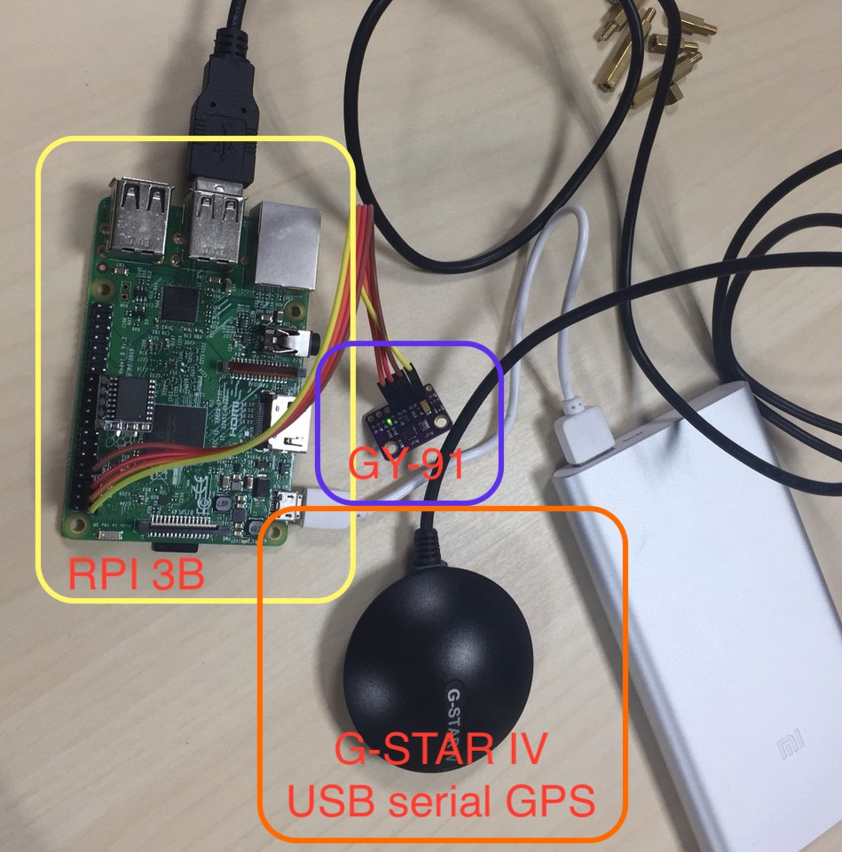

# PiCollector
This is a project using RPI(model 3B, I think other RPIs should work, too),
GPS(usb to serialport with NMEA), G-sensor(GY-91, contains MPU9255, MPU9250 should work, too)
to detect non-smooth road.


Use this in your car, scooter, even with your bike.

## Add auto-install script
1. Download https://downloads.raspberrypi.org/raspbian_lite/images/raspbian_lite-2018-06-29/2018-06-27-raspbian-stretch-lite.zip
2. Install image https://www.raspberrypi.org/documentation/installation/installing-images/README.md
3. copy ./scripts/picollector-auto-install.sh to /boot/picollector-auto-install.sh
4. modify WPA_USER and WPA_PASS for wifi connection
5. login to pi, default username/password is pi/raspberry
6. exec picollector-auto-install.sh with
```
sudo /boot/picollector-auto-install.sh
```
P.S. remember to change CrLf to Lf while you are using windows
7. reboot to take effect

### GPS G-STAR IV (USB to UART GPS receiver)
1. connect G-STAR IV to RPI usb port
2. connect to /dev/ttyUSB0

### GY-91 module
1. connect RPI PINOUT to GY-91
 - 1(3V3) - 3V3
 - 3(I2C1 SDA) - SDA
 - 5(I2C1 SCL) - SCL
 - 9(GND) - GND

### RTC DS3231 module
1. add /boot/config.txt
 - dtoverlay=i2c-gpio,i2c_gpio_sda=10,i2c_gpio_scl=9

2. connect ds3231 module (+) -> (-) to
 - PINOUT 17(3V3)-19(GPIO10)-21(GPIO9)-23(GPIO11)-25(GND)

3. add /etc/modules
 - i2c-dev
 - rtc-ds1307

4. add or uncomment line in /boot/config.txt
 - dtparam=i2c_arm=on

5. add rc.local
 - echo ds1307 0x68 > /sys/class/i2c-adapter/i2c-3/new_device
 - hwclock -s

### Wifi setting notes:
1. scan wifi BSSID
 - sudo iwlist wlan0 scan

2. add WPA auth into system
 - wpa_passphrase "BSSID" "PASSWD" | sed -e '/#.*$/d' | sudo tee -a /etc/wpa_supplicant/wpa_supplicant.conf > /dev/null

3. Auto reconnect to wifi on a raspberry pi
 - reference:
   http://alexba.in/blog/2015/01/14/automatically-reconnecting-wifi-on-a-raspberrypi/
 - add /usr/local/bin/wifi_rebooter.sh

```
#!/bin/bash

# The IP for the server you wish to ping (8.8.8.8 is a public Google DNS server)
SERVER=8.8.8.8

# Only send two pings, sending output to /dev/null
ping -c2 ${SERVER} > /dev/null

# If the return code from ping ($?) is not 0 (meaning there was an error)
if [ $? != 0 ]
then
    # Restart the wireless interface
    ifdown --force wlan0
    ifup wlan0
fi
```
 - add /etc/crontab for every 2 minutes check
```
*/2 *   * * *   root    /usr/local/bin/wifi_rebooter.sh
```

### Before you run
1. Make sure you have "sudo" privilege
2. run "./scripts/prepare.sh"
3. run "sudo ./scripts/run.sh"

